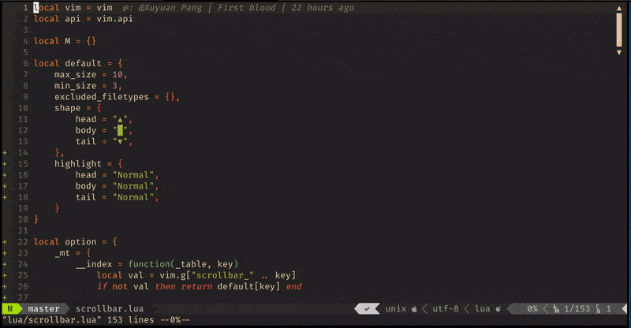

WIP and INCOMPLETED. (not implemented yet)


# chrombar.nvim

[](https://opensource.org/licenses/Apache-2.0)

Chromatic chrombar for neovim (nightly).



## Installation

Just use your favorite plugin manager. e.g. vim-plug:

```vim
Plug 'LumaKernel/chrombar.nvim'
```

## Startup

This plugin provides only two `lua` functions, `show` and `clear`. The following config is recommended.

```vim
augroup ChrombarInit
  autocmd!
  autocmd CursorMoved,VimResized,QuitPre * silent! lua require('chrombar').show()
  autocmd WinEnter,FocusGained           * silent! lua require('chrombar').show()
  autocmd WinLeave,FocusLost             * silent! lua require('chrombar').clear()
augroup end
```

**NOTE:** `clear` is NOT `disable`. To disable it, call `clear`, then remove all the autocommands.

## Options

See in doc `:h chrombar.nvim`.

## Similar Projects

TODO

* []()
